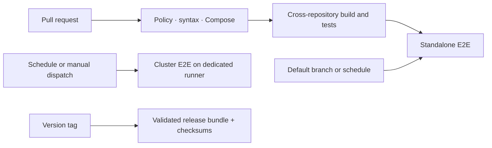

# OpenRec Distribution

[](https://github.com/open-rec/openrec/actions/workflows/quality.yml)
[](https://github.com/open-rec/openrec/actions/workflows/standalone-e2e.yml)
[](https://github.com/open-rec/openrec/actions/workflows/cluster-e2e.yml)
[](LICENSE)

This repository is the **distribution and compatibility authority** for OpenRec. It assembles the
independently developed OpenRec components into versioned standalone and cluster deployments,
provides a reproducible sample dataset and Web Demo, and owns cross-repository end-to-end CI.

[Quick start](#quick-start) · [Deployment modes](#deployment-modes) ·
[Architecture](docs/architecture.md) · [Versioning](docs/versioning.md) ·
[Releasing](docs/releasing.md) · [Organization overview](https://github.com/open-rec)

## What this repository guarantees

- `release/openrec.json` records the exact component refs composing this distribution.
- Pull requests validate repository policy, DAG syntax, shell, Compose, and cross-repository Java
  compatibility.
- Standalone E2E starts real Redis, Elasticsearch, rec-server, rec-console, and the Web Demo, imports
  sample data, and executes a real recommendation request.
- Cluster E2E validates Kafka ingestion, Spark projections, HDFS/Hive persistence, versioned recall
  publication, online recommendation, analytics, deletion semantics, model activation, and rollback.
- Release tags package the manifest, deployment definitions, documentation, sample data, and
  checksums as one immutable distribution bundle.

The component repositories remain the source of their application images and libraries. This
repository defines which component versions are known to work together.

## Quick start

### 1. Clone the distribution and components

```shell
git clone https://github.com/open-rec/example.git
cd example
./scripts/checkout-components.sh
```

The checkout script creates the required sibling layout and checks out the refs in the release
manifest:

```text
openrec/
├── example/
├── bigdata-platform/
├── data-processor/
├── rank-engine/
├── rec-algorithm/
├── rec-console/
├── rec-server/
└── sdk/
```

Pass a destination to create the workspace somewhere else:

```shell
./scripts/checkout-components.sh /opt/openrec
```

### 2. Start standalone

```shell
./example_standalone/start.sh
```

The command builds current component sources in an isolated runtime directory, starts the serving
infrastructure and applications, imports the bundled dataset, verifies the configured serving DAG,
and starts the Web Demo.

| Service | URL |
|---|---|
| Web Demo | http://127.0.0.1:12345 |
| OpenRec Console | http://127.0.0.1:8095 |
| Recommendation API | http://127.0.0.1:13579 |
| Grafana | http://127.0.0.1:3000 |

Stop the applications while retaining infrastructure data, or remove the complete standalone
runtime:

```shell
./example_standalone/stop.sh
./example_standalone/stop.sh --with-storage
```

Sample credentials and published ports are intended only for an isolated development machine.
Review the [standalone guide](example_standalone) before sharing the deployment on a network.

## Deployment modes

| Concern | Standalone | Cluster |
|---|---|---|
| Primary use | Evaluation, development, small-to-medium integration | Distributed, production-oriented integration |
| Ingestion | Direct Redis write | Versioned Kafka mutations |
| Historical storage | Bundled source data | HBase and partitioned Hive/HDFS data |
| Processing | Local loader and algorithms | Spark/Flink streaming and Spark batch jobs |
| Recall release | Local import to Elasticsearch aliases | Airflow + Spark + rec-console validation and activation |
| Ranking | Bypass supported | Trained, evaluated, versioned rank models |
| Control plane | Monitoring, entities, serving graph | Full graph, recall, Airflow, analytics, model, and experiment operations |
| Required host resources | Developer workstation | Dedicated integration host or CI runner |

Start cluster only on a host sized for the complete data platform:

```shell
./example_cluster/start.sh
./example_cluster/verify_daily_recall.sh
./example_cluster/verify_entity_delete.sh
./example_cluster/verify_data_analytics.sh
./example_cluster/verify_rank_model.sh
```

See the [cluster guide](example_cluster) for prerequisites, startup ownership, endpoints, failure
diagnosis, and shutdown behavior.

## Distribution contents

| Path | Purpose |
|---|---|
| [`release/openrec.json`](release/openrec.json) | Distribution version, component repositories, refs, and compatibility metadata |
| [`example_standalone`](example_standalone) | Minimum complete deployment and smoke acceptance |
| [`example_cluster`](example_cluster) | Distributed deployment and lifecycle acceptance suites |
| [`data`](data) | Small committed dataset for deterministic CI and evaluation |
| [`init`](init) | Redis and Elasticsearch data/recall loader |
| [`web`](web) | Interactive recommendation and feedback demo |
| [`scripts`](scripts) | Component checkout, policy validation, and release assembly |
| [`docs`](docs) | Architecture, versioning, release, and CI documentation |

## End-to-end CI



| Workflow | Trigger | Runner | Coverage |
|---|---|---|---|
| `quality.yml` | Pull request and push | GitHub-hosted | Manifest, links, generated files, shell, Python DAGs, Compose, Java build/tests |
| `standalone-e2e.yml` | Main changes, schedule, manual | GitHub-hosted | Complete standalone startup and recommendation acceptance |
| `cluster-e2e.yml` | Schedule and manual | Self-hosted `openrec-cluster` | Complete distributed data, recall, analytics, deletion, model lifecycle |
| `release.yml` | `v*` tag | GitHub-hosted | Version consistency, distribution archive, SHA-256 checksums, GitHub Release |

Cluster CI deliberately requires a dedicated runner because running Kafka, HDFS, Hive, HBase,
Spark, Airflow, Redis, Elasticsearch, Prometheus, Grafana, and all OpenRec applications together is
not reliable on a standard hosted runner. Runner setup and cleanup rules are documented in
[CI](docs/ci.md).

## Versioning and releases

The current development version is stored in [`VERSION`](VERSION). Component repositories may
release independently, but an OpenRec distribution release is valid only when every ref in
`release/openrec.json` is immutable and all required E2E checks pass.

See [versioning](docs/versioning.md) for compatibility rules and [releasing](docs/releasing.md) for
the release checklist. Production automation must consume a version tag or commit digest rather
than `master` or `latest`.

## Contributing and support

Use this repository for installation, distribution, release, and cross-component issues. File
component-local defects in the repository that owns the code. Contributions follow the shared
[OpenRec contribution guide](https://github.com/open-rec/.github/blob/master/CONTRIBUTING.md),
[Code of Conduct](https://github.com/open-rec/.github/blob/master/CODE_OF_CONDUCT.md), and
[Security Policy](https://github.com/open-rec/.github/blob/master/SECURITY.md).

## License

This distribution is licensed under the [Apache License 2.0](LICENSE). Included component and
third-party artifacts retain their respective licenses.
