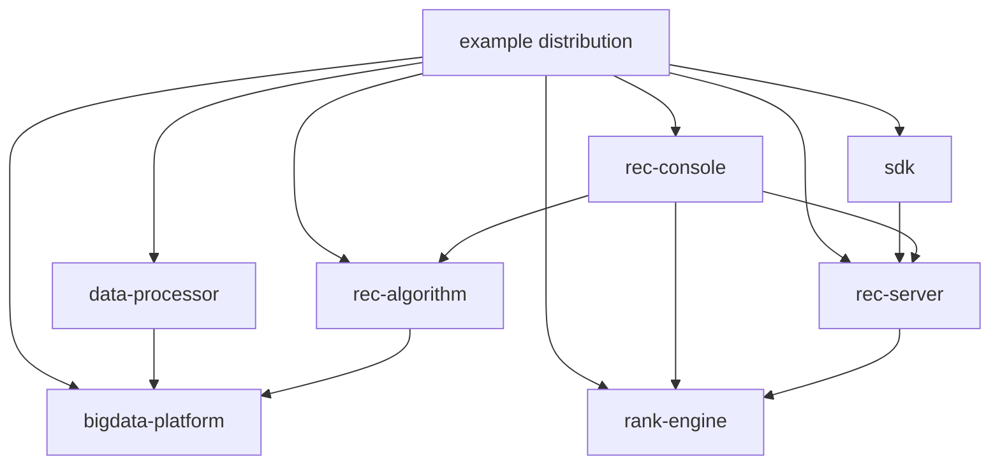
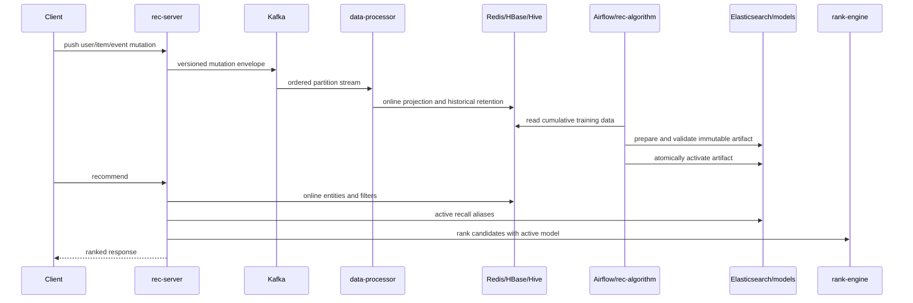

# OpenRec distribution architecture

## Repository boundaries

OpenRec uses a multi-repository architecture. Each component owns a bounded runtime or contract;
this distribution owns their composition and compatibility.

| Owner | Stable responsibility | Key contracts |
|---|---|---|
| `example` | Distribution manifest, deployment composition, sample experience, cross-repo acceptance | Component refs, ports, health and release gates |
| `rec-server` | Online recommendation and ingestion API | HTTP protocol, serving graph, recall store |
| `rec-console` | Operator control plane | Recall/model/graph release APIs, Airflow integration |
| `rec-algorithm` | Offline computation and artifact publication | Recall rows, features, model metadata |
| `rank-engine` | Model loading, training support, online inference | Model artifact and inference API |
| `data-processor` | Streaming mutation projections | Kafka envelope, Redis/HBase/Hive schemas |
| `bigdata-platform` | Dependency lifecycle and observability | Service names, ports, volumes, health checks |
| `sdk` | Application integration | Recommendation and push client contract |

## Standalone data path

1. The loader imports users, items, and events to Redis.
2. Recall tables are loaded into versioned Elasticsearch indexes behind stable active aliases.
3. The Web Demo or SDK calls `rec-server`.
4. The serving DAG gathers candidates, filters and combines them, bypasses remote ranking by
   default, and returns results.
5. The standalone console manages the serving graph and exposes diagnostics and monitoring.

Standalone is the minimum release acceptance because it verifies the shared online contracts with
far fewer moving parts.

## Cluster data and control paths

The control plane does not execute recommendation traffic. It validates and changes versioned
configuration or artifact pointers; online instances continue reading stable contracts.

## Failure boundaries

- If rank inference fails or is disabled, serving policy determines whether to bypass ranking or
  fail the request.
- A recall staging-index failure cannot replace an active alias; activation occurs only after count
  and mapping validation.
- Kafka processing is decoupled from the request response, so cluster pushes acknowledge ingestion
  before all projections become visible.
- Historical Hive/HDFS data is append-oriented; entity deletes are represented as tombstones while
  serving projections are removed.
- Release rollback switches a retained immutable artifact rather than rebuilding it.

## Distribution compatibility

`release/openrec.json` is the machine-readable root of the dependency graph. Development manifests
may point to branches. A stable release must pin component tags or full commit SHAs and must never
depend on floating container tags. See [versioning](versioning.md).
