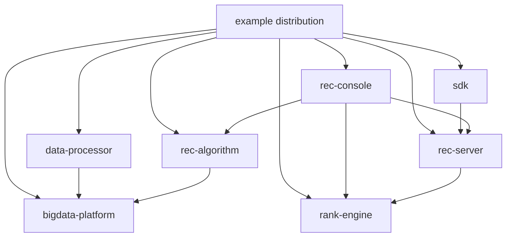
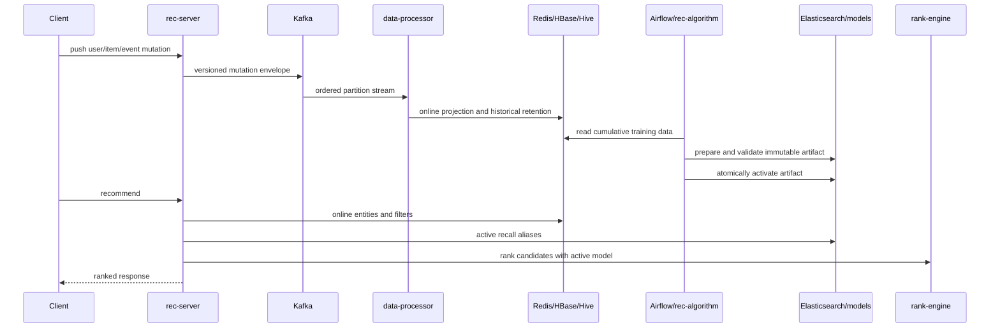

# OpenRec distribution architecture

## Repository boundaries

OpenRec uses a multi-repository architecture. Each component owns a bounded runtime or contract;
this distribution owns their composition and compatibility.

```mermaid
flowchart TD
    Example[example distribution] --> Platform[bigdata-platform]
    Example --> Server[rec-server]
    Example --> Console[rec-console]
    Example --> Algorithm[rec-algorithm]
    Example --> Processor[data-processor]
    Example --> Rank[rank-engine]
    Example --> SDK[sdk]
    SDK --> Server
    Console --> Server
    Console --> Algorithm
    Console --> Rank
    Server --> Rank
    Processor --> Platform
    Algorithm --> Platform
```

| Owner | Stable responsibility | Key contracts |
|---|---|---|
| `example` | Distribution manifest, deployment composition, sample experience, cross-repo acceptance | Component refs, ports, health and release gates |
| `rec-server` | Online recommendation and ingestion API | HTTP protocol, serving graph, recall store |
| `rec-console` | Operator control plane | Recall/model/graph release APIs, Airflow integration |
| `rec-algorithm` | Offline computation and artifact publication | Recall rows, features, model metadata |
| `rank-engine` | Model loading and online inference | Model artifact and inference API |
| `data-processor` | Streaming mutation projections | Kafka envelope, Redis/HBase/Hive schemas |
| `bigdata-platform` | Dependency lifecycle and observability | Service names, ports, volumes, health checks |
| `sdk` | Application integration | Recommendation and push client contract |

## Standalone data path

1. The loader imports users, items, and events to Redis.
2. Recall tables are loaded into versioned Elasticsearch indexes behind stable active aliases.
3. The Web Demo or SDK calls `rec-server`.
4. The serving DAG gathers candidates, filters and combines them, bypasses remote ranking by
   default, and returns results.
5. The standalone console manages the serving graph and exposes diagnostics and monitoring.

Standalone is the minimum release acceptance because it verifies the shared online contracts with
far fewer moving parts.

## Cluster data and control paths

```mermaid
sequenceDiagram
    participant C as Client
    participant O as rec-server
    participant K as Kafka
    participant P as data-processor
    participant D as Redis/HBase/Hive
    participant A as Airflow/rec-algorithm
    participant E as Elasticsearch/models
    participant R as rank-engine

    C->>O: push user/item/event mutation
    O->>K: versioned mutation envelope
    K->>P: ordered partition stream
    P->>D: online projection and historical retention
    A->>D: read cumulative training data
    A->>E: prepare and validate immutable artifact
    A->>E: atomically activate artifact
    C->>O: recommend
    O->>D: online entities and filters
    O->>E: active recall aliases
    O->>R: rank candidates with active model
    O-->>C: ranked response
```

The control plane does not execute recommendation traffic. It validates and changes versioned
configuration or artifact pointers; online instances continue reading stable contracts.

## Feature and model lifecycle

The control plane separates the global feature catalog, offline training, and online deployment.
Catalog registration describes capability, not observed data availability. The algorithm runner's
`training_models` metadata determines which features the cluster training pipeline can materialize;
encoder support alone does not make a feature trainable in that pipeline.

Training follows `rec-console → Airflow → rec-algorithm Spark preparation → offline trainer`.
Rank-engine loads and scores artifacts; it does not execute training. Training remains available
when inference is stopped. Feature engineering, new data collection, and model adapters remain
engineering tasks.

Each model release binds its ordered source/candidate feature selection, selected-definition
fingerprints, fitted encoders, training configuration, evaluation results, and weights. Training
creates a retained immutable version without changing the active model. Publication is explicit
and cannot override the trained selection. Rollback restores the original weights and encoders
without refitting. The `global` artifact scope does not restrict recommendations to a scene named
`global`; item and user ranking have separate deployment targets.

New-format selected-definition fingerprints tolerate unrelated catalog additions while rejecting
incompatible dependencies. Legacy artifacts retain their exact-catalog compatibility checks.
Activation and feature refresh must preserve a consistent model/encoding snapshot. Missing-column
checks do not establish per-entity completeness or freshness; individual missing values follow
the fitted encoder's policy. See the [feature time contract](feature-time-contract.md) for temporal
joins, event identity, and snapshot compatibility.

Model management is enabled in cluster mode. Standalone retains monitoring, entity diagnostics,
and serving-graph operations. Deploy companion components from `release/openrec.json` together,
and retain a compatible model when rolling software back.

## Failure boundaries

- If rank inference fails or is disabled, serving policy determines whether to bypass ranking or
  fail the request.
- A recall staging-index failure cannot replace an active alias; activation occurs only after count
  and mapping validation.
- Kafka processing is decoupled from the request response, so cluster pushes acknowledge ingestion
  before all projections become visible.
- Historical Hive/HDFS data is append-oriented; entity deletes are represented as tombstones while
  serving projections are removed.
- Release rollback switches a retained immutable artifact rather than rebuilding it.

## Distribution compatibility

`release/openrec.json` is the machine-readable root of the dependency graph. Development manifests
may point to branches. A stable release must pin component tags or full commit SHAs and must never
depend on floating container tags. See [versioning](versioning.md).
