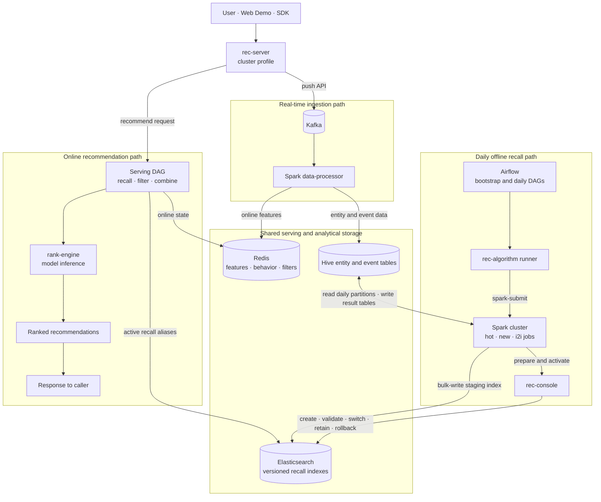
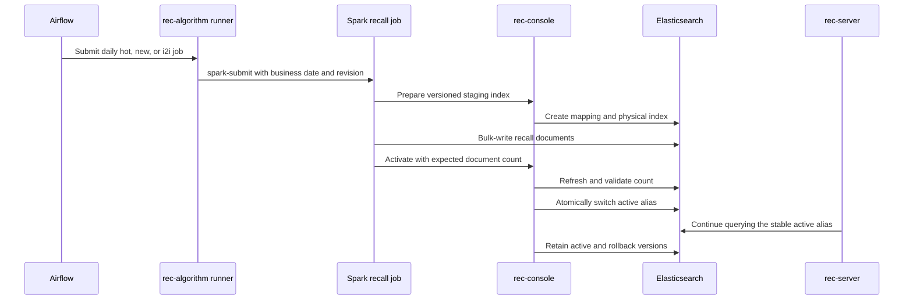

# example cluster

This example is the composition root for the complete distributed OpenRec recommendation chain.
It combines infrastructure from `bigdata-platform`, service-owned containers from `rec-server`,
`rank-engine`, `rec-algorithm`, and `rec-console`, the Spark `data-processor`, OpenRec Airflow DAGs,
sample data, and the Web Demo.



The release protocol keeps online serving independent from physical index versions:



## ownership

Each layer has one responsibility:

| Layer | Owner | Responsibility |
|---|---|---|
| Infrastructure | `bigdata-platform` | Kafka, HDFS, Hive, Spark, Flink, Redis, Elasticsearch, Airflow |
| Online services | `rec-server`, `rank-engine` | Recommendation and ranking service containers |
| Recall control | `rec-console` | Recall index preparation, activation, retention, switching, and rollback |
| Offline jobs | `rec-algorithm` | Spark recall computation and staging-index writes |
| Streaming pipeline | `data-processor` | Kafka to Redis and Hive-backed storage processing job |
| Business workflow | `example_cluster/airflow` | Bootstrap verification, daily recall publishing, and rollback orchestration |
| Composition | `example_cluster` | Build, initialize, start, verify, and stop the complete example |

The example Compose file uses `include`; it does not duplicate service build or runtime settings.
Airflow communicates through normal service protocols on `openrec-bigdata`. It has no Docker socket
and does not manage containers.

## quick start

From the workspace root:

```shell
./example/example_cluster/start.sh
```

The command performs the complete cold-start path:

1. Builds and starts the `bigdata-platform` cluster preset, then runs its infrastructure smoke tests.
2. Builds the SDK, Spark feature processor, sample loader, and Web Demo in `.runtime/build`.
3. Installs the OpenRec Hive entity tables and submits the Spark streaming processor.
4. Loads bootstrap entities and behavior into Redis, plus sample recall aliases and vectors into Elasticsearch.
5. Builds and starts `rec-server`, `rank-engine`, the recall runner, and `rec-console` containers.
6. Triggers the `openrec_cluster_bootstrap` Airflow DAG and waits for success.
7. Starts the Web Demo only after the complete recommendation chain passes.

The startup-triggered `openrec_cluster_bootstrap` DAG verifies:

- Kafka, HDFS, Hive, Spark workers, Redis, and Elasticsearch are reachable and ready.
- `rank-engine`, cluster-mode `rec-server`, the recall runner, and `rec-console` are healthy.
- A real recommendation returns candidates.
- A uniquely named user pushed to `rec-server` reaches Redis through Kafka and the Spark
  `data-processor`; unique data prevents a previous run from producing a false-positive result.

The same DAG directory also defines `openrec_daily_recall` for `02:00 UTC` and the manual
`openrec_recall_rollback` DAG. New DAGs are paused by default, so enable `openrec_daily_recall` in
Airflow when daily publication should begin. Bootstrap does not run the daily recall job: daily
jobs read partitioned Hive data, submit hot/new/i2i Spark computations through
`rec-algorithm-runner`, and ask `rec-console` to validate and atomically activate the resulting
Elasticsearch indexes.

Startup aborts and cleans up if any phase fails. On success, the main endpoints are:

| Service | URL |
|---|---|
| Web Demo | `http://127.0.0.1:12345` |
| rec-server | `http://127.0.0.1:13579` |
| rank-engine | `http://127.0.0.1:8123` |
| rec-console | `http://<host>:8095` |
| rec-console API | `http://<host>:8095/docs` |
| Airflow | `http://127.0.0.1:8091` |
| Spark | `http://127.0.0.1:8083` |
| Flink | `http://127.0.0.1:8087` |

## stop and restart

Stop everything owned by this cluster example while retaining Docker volumes:

```shell
./example/example_cluster/stop.sh
```

Stop the business applications and streaming job while keeping the infrastructure running for a
faster restart:

```shell
./example/example_cluster/stop.sh --keep-platform
```

Only an explicit platform volume deletion removes persisted data:

```shell
./bigdata-platform/platform.sh down -v
```

The cluster stop command does not touch `example_standalone` processes or containers.

## standalone compared with cluster

| Concern | standalone | cluster |
|---|---|---|
| Infrastructure preset | Redis and Elasticsearch | Complete distributed platform |
| Push path | rec-server writes Redis directly | rec-server publishes to Kafka |
| Processing | Not required | Spark data-processor writes Redis and Hive-backed storage |
| Ranking service | Disabled | rank-engine container |
| Airflow workflow | Not required | Bootstrap, daily recall, and manual rollback DAGs |
| Recall publishing | Bundled sample import | Spark staging writes with `rec-console` version control |
| rec-server profile | `standalone` | `cluster` |

Both examples use the same rec-server image, serving DAG, Redis/Elasticsearch schema, sample loader,
and Web Demo. Runtime configuration selects the deployment behavior.

## troubleshooting

Inspect each ownership layer independently:

```shell
./bigdata-platform/platform.sh ps
./bigdata-platform/platform.sh logs airflow-api-server spark-master kafka-1
docker compose -f example/example_cluster/docker-compose.yml ps
docker compose -f example/example_cluster/docker-compose.yml logs rec-server rank-engine rec-algorithm-runner rec-console
docker exec spark-master cat /tmp/openrec-data-processor.log
```

Application build output, Web Demo logs, and PID state are isolated under
`example/example_cluster/.runtime/`. Airflow DAG source remains under
`example/example_cluster/airflow/dags/` and is mounted read-only by the platform.
