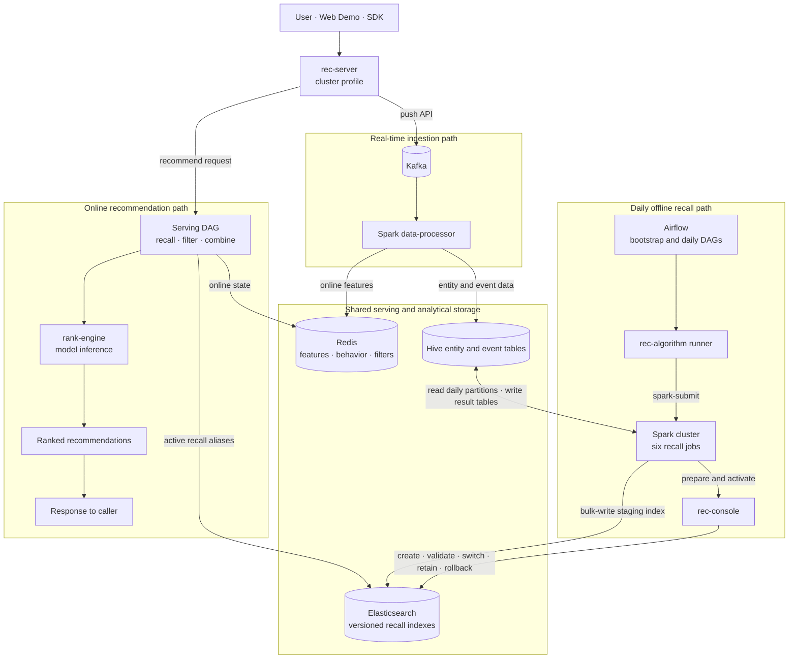
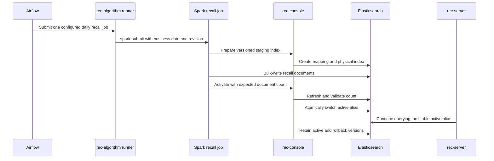

# OpenRec Cluster Example

This is a distributed integration and production reference architecture, not a production-ready HA
deployment. The default topology exposes development credentials and includes single points of
failure; isolate it from untrusted networks and review the security, persistence, backup, and
capacity requirements of every dependency before using real data.

This example is the composition root for the complete distributed OpenRec recommendation chain.
It combines infrastructure from `bigdata-platform`, service-owned containers from `rec-server`,
`rank-engine`, `rec-algorithm`, and `rec-console`, the Spark `data-processor`, OpenRec Airflow DAGs,
sample data, and the Web Demo.



The release protocol keeps online serving independent from physical index versions:



## ownership

Each layer has one responsibility:

| Layer | Owner | Responsibility |
|---|---|---|
| Infrastructure | `bigdata-platform` | Kafka, HDFS, Hive, Spark, Flink, Redis, Elasticsearch, Airflow |
| Online services | `rec-server`, `rank-engine` | Recommendation and ranking service containers |
| Recall control | `rec-console` | Recall index preparation, activation, retention, switching, and rollback |
| Offline jobs | `rec-algorithm` | Spark recall computation and staging-index writes |
| Streaming pipeline | `data-processor` | Kafka to Redis and Hive-backed storage processing job |
| Business workflow | `example_cluster/airflow` | Bootstrap verification, daily recall publishing, and rollback orchestration |
| Composition | `example_cluster` | Build, initialize, start, verify, and stop the complete example |

The example Compose file uses `include`; it does not duplicate service build or runtime settings.
Airflow communicates through normal service protocols on `openrec-bigdata`. It has no Docker socket
and does not manage containers.

## quick start

From the workspace root:

```shell
./example/example_cluster/start.sh
```

For a mainland-China development host that cannot reliably reach Docker Hub or PyPI, select the
local mirror defaults without exporting variables manually:

```shell
./example/example_cluster/start.sh --local
```

`--local` uses the Aliyun PyTorch base image and the Tsinghua PyPI mirror. Explicit
`RANK_BASE_IMAGE` or `RANK_PIP_INDEX_URL` environment values still take precedence when a different
local registry or package mirror is required.

The command performs the complete cold-start path:

1. Builds and starts the `bigdata-platform` cluster preset, then runs its infrastructure smoke tests.
2. Builds the SDK, Spark feature processor, sample loader, and Web Demo in `.runtime/build`.
3. Installs the OpenRec Hive entity tables and submits the Spark streaming processor.
4. Loads bootstrap entities and behavior into Redis, plus sample recall aliases and vectors into Elasticsearch.
5. Builds and starts `rec-server`, `rank-engine`, the recall runner, and `rec-console` containers.
6. Triggers the `openrec_cluster_bootstrap` Airflow DAG and waits for success.
7. Starts the Web Demo only after the complete recommendation chain passes.

The startup-triggered `openrec_cluster_bootstrap` DAG verifies:

- Kafka, HDFS, Hive, Spark workers, Redis, and Elasticsearch are reachable and ready.
- `rank-engine`, cluster-mode `rec-server`, the recall runner, and `rec-console` are healthy.
- A real recommendation returns candidates.
- A uniquely named user pushed to `rec-server` reaches Redis through Kafka and the Spark
  `data-processor`; unique data prevents a previous run from producing a false-positive result.

The same DAG directory also defines `openrec_daily_recall` for `02:00 UTC` and the manual
`openrec_recall_rollback` DAG. New DAGs are paused by default, so enable `openrec_daily_recall` in
Airflow when daily publication should begin. Bootstrap does not run the daily recall job: daily
jobs read partitioned Hive data and submit hot/new/`item_cf_i2i`/`content_i2i`/`user_cf_u2i`/
`item_seq_emb` Spark computations through
`rec-algorithm-runner`, and ask `rec-console` to validate and atomically activate the resulting
Elasticsearch indexes.

The ODS entity tables remain immutable daily partitions, while a daily recall run reads every
partition through its business date. Events are de-duplicated by trace/event id and retained as
cumulative behavior; repeated user and item records are collapsed to their latest as-of snapshot.
This preserves cheap partitioned ingestion without incorrectly training recall on only one day.

After the cluster is running, execute the dedicated end-to-end acceptance without lengthening every
normal startup:

```shell
./example/example_cluster/verify_daily_recall.sh
# Optional reproducible backfill/re-run:
./example/example_cluster/verify_daily_recall.sh 2026-08-21 r002
```

It writes deterministic item/event data through the real Push API, waits for the Hive ODS
partitions, triggers Airflow with an explicit business date and revision, and requires non-empty
hot/`item_cf_i2i` indexes, exact active aliases, and an online recommendation containing the required recall
channels. The check does not require `new`; applications own the online supply of newly published
items.

The rec-console DAG module provides the operational UI for Airflow DAG status, pause/enable,
manual triggers, DagRun and TaskInstance state, and task logs. Its structured daily-recall editor
versions and publishes cron, ordered algorithm dependencies, default revision, retention, and retry
settings through the shared `openrec-dag-config` volume. Airflow mounts that configuration
read-only; the Python DAG source remains read-only and arbitrary Python editing is not exposed in
the browser.

The rec-console Serving Graph module reads the active online graph from rec-server, renders its
node and edge topology, edits individual node settings, and publishes a complete graph snapshot.
rec-server performs the final structural and Java-class validation before atomically applying it;
accepted versions are retained by rec-console for rollback.

### rank model lifecycle acceptance

The manual `openrec_rank_model` DAG reads cumulative Hive partitions through the requested business
date, removes events for deleted items, prepares samples with a four-core Spark submission, trains
an LR checkpoint, evaluates its held-out AUC gate, and atomically publishes the retained version to
rank-engine. `openrec_rank_model_rollback` reactivates a retained version without retraining.

Run the deterministic two-version acceptance after the cluster is healthy:

```shell
bash example/example_cluster/verify_rank_model.sh 2026-08-21
```

The script verifies Hive ingestion, an LR and an FM train/evaluate/publish run with their independent
Feature Sets and fitted sidecars, release metadata and checksums, FM scores returned through the
rec-server online DAG, and rollback to the LR version. Model releases are also visible under the
rec-console **Rank Model** page.

Validate the rec-console business-analysis dashboard with isolated deterministic events:

```shell
bash example/example_cluster/verify_data_analytics.sh 2026-08-21
```

This checks the real Push → Kafka → Spark → Hive → rec-console path for PV/UV CTR, PV/UV CVR,
active-item count, and GMV (`quantity × price`).

Startup aborts and cleans up if any phase fails. On success, the main endpoints are:

| Service | URL |
|---|---|
| Web Demo | `http://127.0.0.1:12345` |
| rec-server | `http://127.0.0.1:13579` |
| rank-engine | `http://127.0.0.1:8123` |
| rec-console | `http://<host>:8095` |
| rec-console API | `http://<host>:8095/docs` |
| Airflow | `http://127.0.0.1:8091` |
| Spark | `http://127.0.0.1:8083` |
| Flink | `http://127.0.0.1:8087` |

## stop and restart

Stop everything owned by this cluster example while retaining Docker volumes:

```shell
./example/example_cluster/stop.sh
```

Stop the business applications and streaming job while keeping the infrastructure running for a
faster restart:

```shell
./example/example_cluster/stop.sh --keep-platform
```

Only an explicit platform volume deletion removes persisted data:

```shell
./bigdata-platform/platform.sh down -v
```

The cluster stop command does not touch `example_standalone` processes or containers.

## standalone compared with cluster

| Concern | standalone | cluster |
|---|---|---|
| Infrastructure preset | Redis and Elasticsearch | Complete distributed platform |
| Push path | rec-server writes Redis directly | rec-server publishes to Kafka |
| Processing | Not required | Spark data-processor writes Redis and Hive-backed storage |
| Ranking service | Disabled | rank-engine container |
| Airflow workflow | Not required | Bootstrap, daily recall, model release, and rollback DAGs |
| Default artifact bootstrap | Hash-validated `model/` reuse or rebuild | Same bundle; cluster releases may overwrite defaults |
| Recall publishing | `model/recall` import | Spark staging writes with `rec-console` version control |
| rec-server profile | `standalone` | `cluster` |
| Exposure collection | Synthetic exposure enabled | Synthetic exposure disabled; browser reports cards visible at least 50% through Push API |

Both examples use the same rec-server image, serving DAG, Redis/Elasticsearch schema, sample loader,
and Web Demo. Runtime configuration selects the deployment behavior.

## troubleshooting

Inspect each ownership layer independently:

```shell
./bigdata-platform/platform.sh ps
./bigdata-platform/platform.sh logs airflow-api-server spark-master kafka-1
docker compose -f example/example_cluster/docker-compose.yml ps
docker compose -f example/example_cluster/docker-compose.yml logs rec-server rank-engine rec-algorithm-runner rec-console
docker exec spark-master cat /tmp/openrec-data-processor.log
```

Application build output, Web Demo logs, and PID state are isolated under
`example/example_cluster/.runtime/`. Airflow DAG source remains under
`example/example_cluster/airflow/dags/` and is mounted read-only by the platform.
