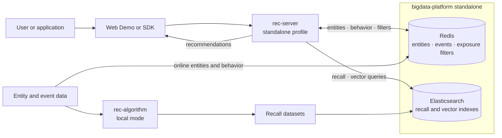

# example standalone

Run the minimum OpenRec recommendation chain on one machine. Redis and Elasticsearch come from the
sibling `bigdata-platform` repository; the containerized `rec-server` runs with its `standalone`
profile and writes pushed users, items, and events directly to Redis. The standalone rec-console
provides monitoring, entity diagnostics, and Serving Graph management. Kafka, Spark, Airflow, and
`rank-engine` are not required.



The diagram is deployment-level. The recall, filtering, combination, and operation nodes inside
`rec-server` are documented in the rec-server serving DAG and are intentionally not repeated here.

## Prerequisites and layout

Install Docker with the Compose plugin, JDK 8, and Maven 3.6+. Keep the component repositories in
the workspace layout used by this project:

```text
openrec/
├── bigdata-platform/
├── rec-algorithm/       # optional: regenerate the bundled recall datasets
├── rec-console/
├── rec-server/
├── sdk/
└── example/
```

All commands below start from the `openrec/` workspace root. The serving containers use the values
defined in `bigdata-platform/.env`:

| Service | Host endpoint | Credentials |
|---|---|---|
| Redis | `127.0.0.1:6380` | none |
| Elasticsearch | `https://127.0.0.1:9200` | `elastic` / `openrec-es-password` |
| rec-server | `http://127.0.0.1:13579` | none |
| rec-console | `http://127.0.0.1:8095` | none |
| Web Demo | `http://127.0.0.1:12345` | none |

The `rec-server` standalone properties already match these defaults. If `.env` is changed, override the
corresponding Spring properties when starting the server and pass the same values to the loader.

## One-command experience

Run the complete chain from infrastructure through the visual demo:

```shell
./example/example_standalone/start.sh
```

The script requires JDK 8, starts and checks the standalone infrastructure, builds the Java client
components, imports the bundled sample entities, behavior, and recall datasets, builds and starts
the rec-server and standalone rec-console containers, and sends a real recommendation request
before starting the Web Demo.
The smoke request explicitly routes to the default experiment and verifies `item_cf_i2i`,
`content_i2i`, `user_cf_u2i`, `item_seq_emb`, and hot
results from its `WeightedChannelOperationRule` while bypassing Rank and Kafka. It intentionally
does not require `new`, whose online item supply belongs to the application.
Open the URL printed at completion: `http://127.0.0.1:12345`. The script exits with a clear error if
either application port is already occupied.

Java components are built from current sources in an isolated `.runtime/build` tree. This avoids
permission or stale-artifact problems when repository `target/` directories were created in a
container, and does not modify those directories.

Web Demo logs and its PID file are kept under `example/example_standalone/.runtime/`. The rec-server
container is owned by the example Compose project. Stop the applications while retaining data, or
stop storage as well:

```shell
./example/example_standalone/stop.sh
./example/example_standalone/stop.sh --with-storage
```

The detailed steps below remain useful for development and troubleshooting.

## 1. Start the storage containers

Build the two images once, then start only the serving layer. Do not install Redis or Elasticsearch
on the host.

```shell
cd bigdata-platform
./platform.sh build standalone
./platform.sh up standalone
./platform.sh ps
./platform.sh smoke standalone
cd ..
```

Bring-up is asynchronous. If `smoke` fails immediately after `up`, inspect
`./platform.sh logs redis elasticsearch`, wait for both health checks, and run it again.

## 2. Build the Java components

Build in dependency order. `rec-server install` publishes `rec-proto`, and the SDK publishes
`rec-client`; both are required by the example loader.

```shell
cd rec-server
mvn clean install -DskipTests
cd ../sdk/java-client
mvn clean install -DskipTests
cd ../../example/init
mvn clean package -DskipTests
cd ../..
```

## 3. Load the sample data

`start.sh` supports direct mode switching. If cluster application containers or its managed Web
Demo are running, it stops the cluster application layer with `example_cluster/stop.sh
--keep-platform` before doing any build or data import. Redis, Elasticsearch and the remaining
shared platform stay running. Unrelated processes occupying standalone ports still cause an early,
non-destructive failure.

Run the loader from `example/`, because its default `data/test` path is relative to the current
working directory:

```shell
cd example
java -cp init/target/rec-example-init-1.0-SNAPSHOT-jar-with-dependencies.jar \
  com.openrec.example.InitStandalone \
  127.0.0.1 6380 127.0.0.1 9200 elastic 'openrec-es-password'
cd ..
```

The start script first validates `model/default.manifest.json` against the raw CSV hashes and rebuilds
stale deployable artifacts. The loader imports users, items, events and feature snapshots into
Redis. It loads hot, new, item-CF I2I, content I2I, and UserCF U2I into versioned Elasticsearch
indexes behind `openrec-recall-{tableName}-active`, and `item_seq_emb` vectors into the per-scene vector
index. Development-only Redis copies of those recall tables are also loaded for RecallStore parity checks,
but the standalone rec-server uses `ElasticsearchRecallStore` by default. Direct loader invocation
accepts optional `data_dir` and `model_dir` arguments.

Verify the imported data through the containers:

```shell
docker exec redis redis-cli DBSIZE
docker exec redis redis-cli ZCARD 'event:{user_247}:scene_0:click'
curl -k -u elastic:openrec-es-password 'https://127.0.0.1:9200/_cat/indices?v'
curl -k -u elastic:openrec-es-password \
  'https://127.0.0.1:9200/_alias/openrec-recall-*-active'
```

## 4. Start rec-server

The graph keeps the `rank` node enabled so Cluster can use the same DAG. In Standalone,
`application-standalone.properties` sets `rank.open=false`; RankNode therefore passes the complete
combine result to the operation strategy without contacting `rank-engine`.

```shell
docker compose -f rec-server/docker-compose.standalone.yml up -d --build --wait
```

The default operation rule allocates results across `item_cf_i2i`, `content_i2i`, `user_cf_u2i`,
`item_seq_emb`, hot, and new,
selecting the highest scores available inside those quotas. The image includes the operation plugin.
To try the random insertion strategy instead, set `operationName` to `RandomInsertOperationRule`;
the bundled
configuration reserves 10% hot and 10% new candidates at random positions. Startup verification does
not require the `new` share to be present because applications own the online supply of newly
published items.

## 5. Verify recommendations

```shell
curl http://127.0.0.1:13579/health

curl -s -X POST http://127.0.0.1:13579/api/recommend \
  -H 'Content-Type: application/json' -d '{
  "requestId": "standalone-1",
  "body": {
    "scene": "scene_0",
    "size": 10,
    "userId": "user_247",
    "deviceId": "device-1",
    "type": "click",
    "debug": true
  }
}'
```

Swagger UI is available at `http://127.0.0.1:13579/swagger-ui/index.html`. With `debug: true`, each
result includes its recall channel and score.

## 6. Start the visual demo

```shell
cd example/web
mvn clean package -DskipTests
java -jar target/rec-example-web-1.0-SNAPSHOT.jar
```

Open `http://127.0.0.1:12345`.

## Operations and troubleshooting

Manage storage exclusively through `bigdata-platform`:

```shell
cd bigdata-platform
./platform.sh ps
./platform.sh logs redis elasticsearch
./platform.sh restart redis elasticsearch
./platform.sh down
```

- A cold Elasticsearch connection can make the first recommendation incomplete. Warm the service
  with a request and retry; keep the serving DAG latency limits unchanged.
- Repeated requests can exhaust the visible sample candidates because `collector` records exposure
  and `filter` excludes exposed items for 24 hours.
- If the loader cannot connect, confirm that Redis uses host port `6380`, not its container port
  `6379`, and that the Elasticsearch password still matches `bigdata-platform/.env`.
- `./platform.sh down -v` also deletes stored data. Use it only when a complete reset is intended,
  then rerun the loader.
